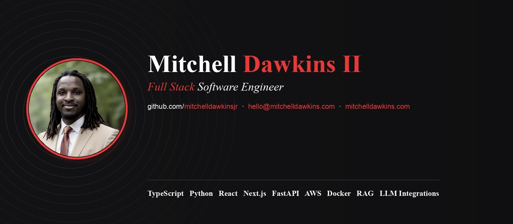

Full-stack engineer with **10+ years** building scalable web apps across enterprise and growth-stage environments. Dropbox alum. Currently building federal/enterprise software at AdHoc Research Associates — and shipping open-source AI tooling, self-hosted infra, and sports analytics on the side.

I believe we're at an inflection point where AI, used with experience and solid fundamentals, can dramatically change how we build software.

🌐 [mitchelldawkins.com](https://mitchelldawkins.com) · ✉️ [hello@mitchelldawkins.com](mailto:hello@mitchelldawkins.com) · 💼 [LinkedIn](https://linkedin.com/in/mitchell-dawkins-ii-81614687/)

---

### Skills

**Languages**  
`TypeScript` `JavaScript` `Python` `PHP` `Go` `SQL`

**Frameworks**  
`React` `Next.js` `Vue` `SvelteKit` `Node.js` `Laravel` `Symfony` `Flask` `FastAPI` `Redux`

**Cloud & DevOps**  
`AWS` `Docker` `CI/CD` `GitHub Actions` `Nginx` `PostgreSQL` `Redis` `MySQL`

**AI / ML**  
`RAG` `LLM Integrations` `Prompt Engineering` `NLP` `Whisper` `Hugging Face` `OpenAI` `Ollama` `n8n`

**AI Tools**  
`Cursor` `Claude` `ChatGPT` `Grok`

---

### Featured projects

| Project | What it is |
|--------|------------|
| [**SEOS**](https://github.com/mitchelldawkinsjr/SEOS) | AI-native repo OS — specialist agents, label workflows, knowledge loop |
| [**Fasted**](https://github.com/mitchelldawkinsjr/Fasted) | Offline-first biblical fasting companion PWA |
| [**Thinker**](https://github.com/mitchelldawkinsjr/thinker) | Microlearning PWA with catalog-grounded Ask (OpenAI / Ollama) |
| [**Power & Context**](https://github.com/mitchelldawkinsjr/power-and-context) | Self-hosted article → NPR-style podcast via local LLMs + TTS |
| [**NBA Stat Spot**](https://github.com/mitchelldawkinsjr/NBA-Stat-Spot) | NBA analytics + AI prop predictions |
| [**360 Web Solutions Cloud**](https://github.com/mitchelldawkinsjr/360-Web-Solutions-Cloud) | Self-hosted VPS fleet + Docker/FastAPI control plane for WordPress |
| [**GH Film Review**](https://github.com/mitchelldawkinsjr/GH-Flim-Review) | CSV film logs → weekly/season football evaluation reports |
| [**GHFB**](https://github.com/mitchelldawkinsjr/ghfb) | Sheet-first coach PWA — attendance, lift, film hub |

More on [mitchelldawkins.com/projects](https://mitchelldawkins.com/projects) · Writing: [Building AI with AI](https://mitchelldawkins.com/blog)

---

### Currently

- Senior Computer Programmer @ AdHoc Research Associates (enterprise PHP / Vue)
- Experimenting with agent pipelines, self-hosted infra, and coaching tooling
- Helping run the [Dawkins Family Foundation](https://dawkinsfamilyfoundation.org/)
